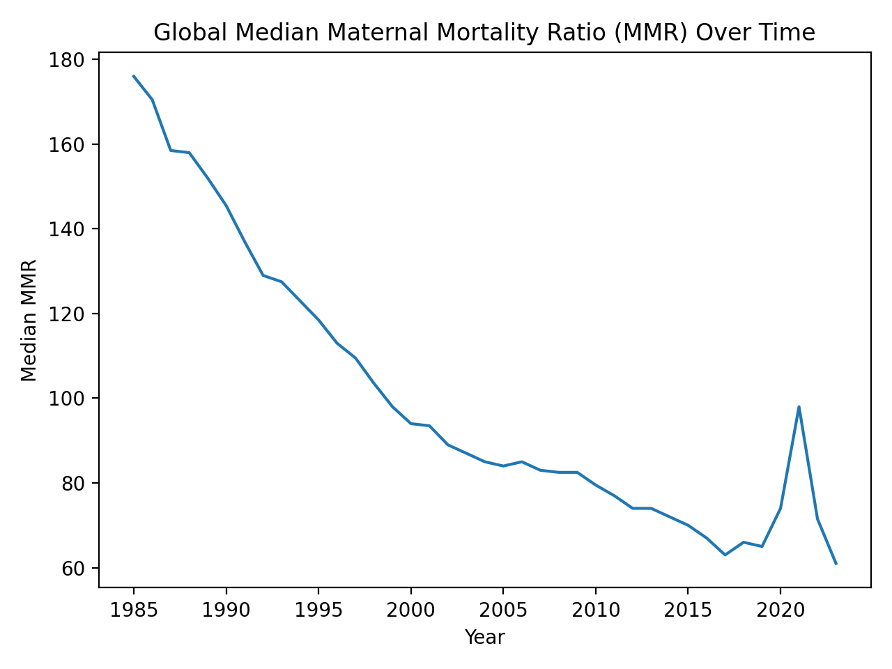
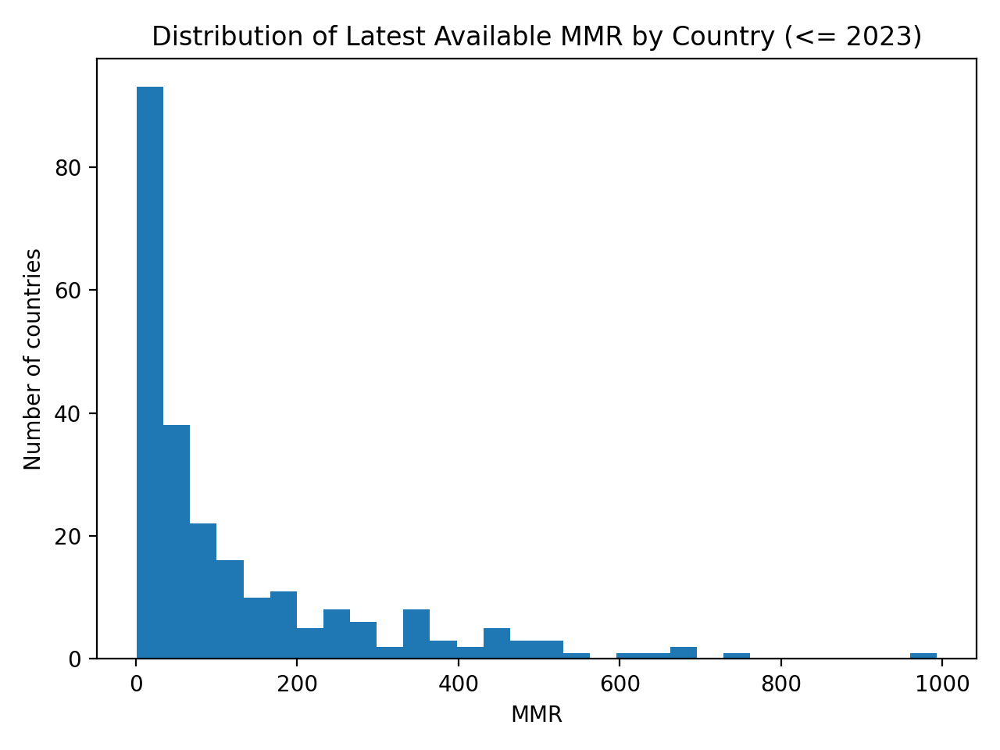
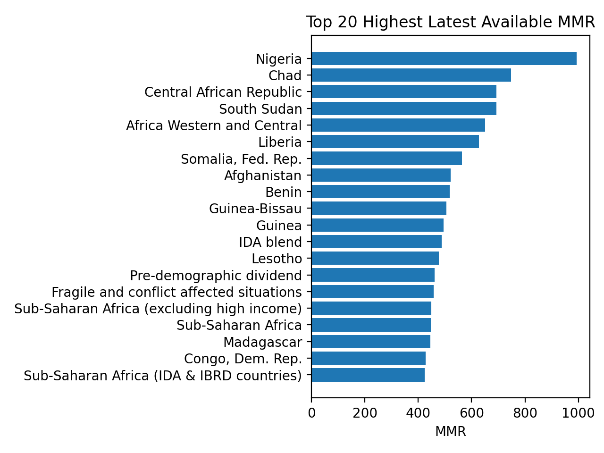

## Maternal Mortality Analytics

A Reproducible WSL Pipeline with Panel Modeling and Forecasting.

### Overview

This project implements an end-to-end, reproducible health data analytics pipeline using WSL + Python to analyze global maternal mortality trends using World Bank indicator data. The workflow covers data ingestion, cleaning, exploratory analysis, panel modeling, and time-aware forecasting, with an extensible foundation for machine learning.

### Project Concept

**Goal:** Build an end-to-end health analytics pipeline that:

-   Creates reproducible Ingestion and tidy transformation.

-   Conducts exploratory analytics (trends, regional comparisons, missingness).

-   Fits interpretable statistical models (baseline).

-   Adds ML extension for forecasting/predicting “next-year's MMR” and risk profiling.

### Data Source

The data sets used for this analysis were obtained from the World Bank Group's [Maternal Mortality](https://databank.worldbank.org/reports.aspx?source=2&series=SH.STA.MMRT&country=#) data set.

**Outputs:**

-   A reproducible analysis report (Markdown).

-   Cleaned “tidy” dataset saved to /data/processed/

-   Model evaluation summary tables (baseline + ML).

-   A small set of charts in /reports/figs/

### Repo Structure

```{bash}
maternal-mortality-analytics/
├── README.md
├── data/
│   ├── raw/
│   └── processed/
├── reports/
│   ├── figs/
│   └── report.md  
├── script/
│   ├── ingest.py    
│   ├── clean.py     
│   ├── eda.py       
│   └── model.py     
└── environment/
    ├── requirements.txt 
    └── Makefile 
```

### Pipeline Execution

Each Python script was tested in JupyterLab before importing into the shell script to run on WSL. Ensure you run scripts sequentially from the project root directory.

#### Data ingestion and tidying:

Key steps in this phase included:

-   Converting World Bank wide-format data to tidy long format.

-   Standardizing year fields and numeric fields.

-   Adding log-transformed outcomes.

-   Merging country and indicator metadata (when available).

Script: 01_ingest_tidy.py

Output:

-   mmr_long.parquet

-   mmr_long.csv

#### Exploratory data analysis (EDA):

EDA focused on global trends, cross-country variation, and data completeness.

Script: 02_eda.py

Output:







#### Modeling and forecasting:

Focused on Panel Model (Baseline and Forecasting Model (Machine Learning Ready).

Script: 03_model.py

Output:

-   panel_model_summary.txt

-   forecast_metrics.csv

-   forecast_predictions.csv

### Key Result Insights

-   Clear global decline in median maternal mortality over time.

-   Substantial cross-country heterogeneity remains after controlling for trends.

-   Lag-based models provide a strong baseline for short-term forecasting.

-   Pipeline is structured for easy extension with additional covariates or models.
